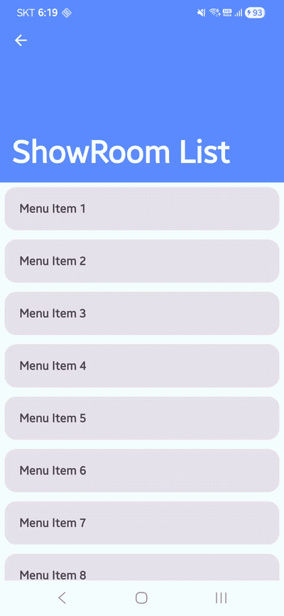
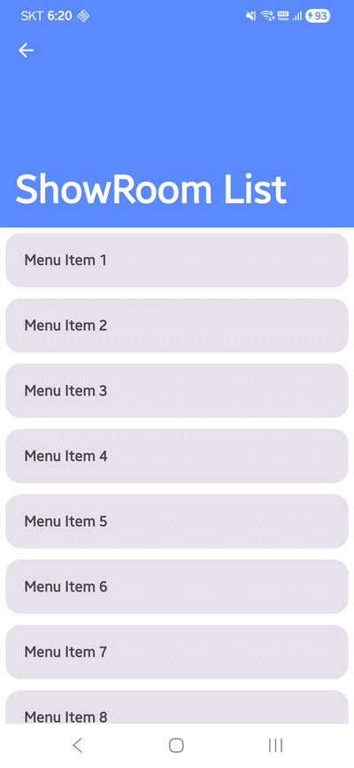
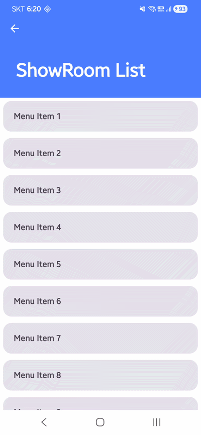
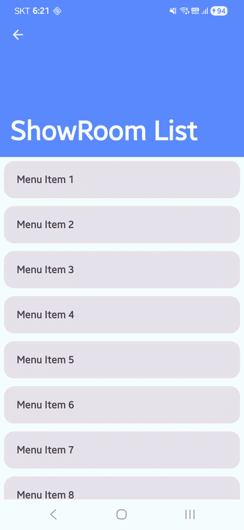
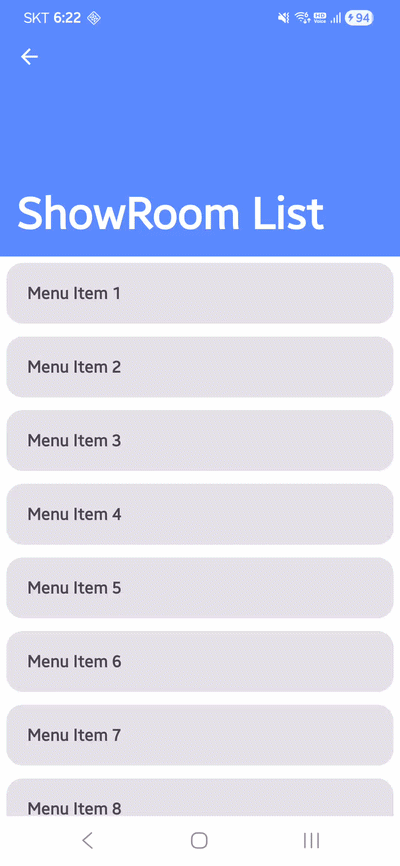
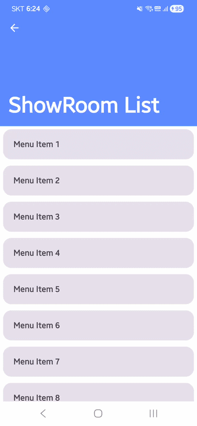
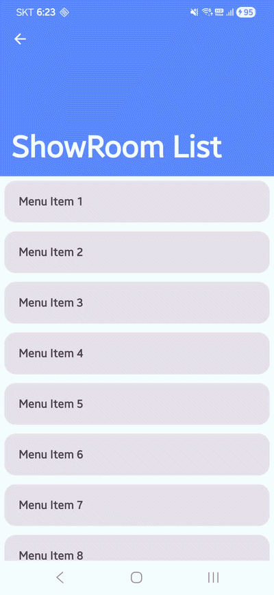
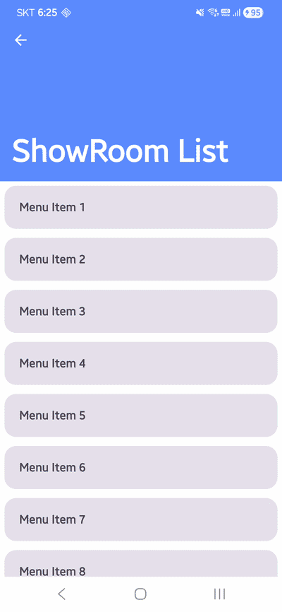
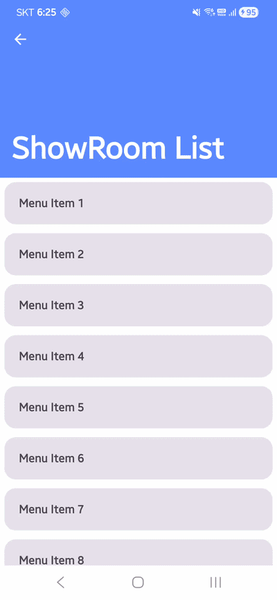

## GroovinCollapsingToolBar
[](https://central.sonatype.com/artifact/io.groovin/collapsingtoolbar)

This library offers a Collapsing Tool Bar Layout for Jetpack Compose.



## Including in your project
### Gradle
And add a dependency code to your **module**'s `build.gradle` file.
```gradle
dependencies {
    implementation 'io.groovin:collapsingtoolbar:x.x.x'
}
```


## Usage
### CollapsingToolBarLayout
`CollapsingToolBarLayout` is Composable Scaffold Layout that contains ToolBar & Content.
```kotlin
CollapsingToolBarLayout(
    state = rememberCollapsingToolBarState(200.dp, 56.dp),
    updateToolBarHeightManually = false, //Optional, default false
    toolbar = {
        //in CollapsingToolBarLayoutToolBarScope
        ToolBar(...) //Tool Bar Composable
    }
) {
    //in CollapsingToolBarLayoutContentScope
    Content(...) //Content Composable
}
```

#### CollapsingToolBarState
CollapsingToolBar needs `CollapsingToolBarState` instance for store and use its status.
```kotlin
val collapsingToolBarState = rememberCollapsingToolBarState(
    toolBarMaxHeight = 200.dp,
    toolBarMinHeight = 56.dp,
    collapsingOption = CollapsingOption.EnterAlwaysCollapsed
)
```
You need to define ToolBar's Min/Max Height. also, You can define the collapsing Options.
 - CollapsingOption.EnterAlways
 - CollapsingOption.EnterAlwaysCollapsed `default`
 - CollapsingOption.EnterAlwaysAutoSnap
 - CollapsingOption.EnterAlwaysCollapsedAutoSnap

|                                                          EnterAlways                                                          |                                                          EnterAlwaysCollapsed                                                          |
|:-----------------------------------------------------------------------------------------------------------------------------:|:--------------------------------------------------------------------------------------------------------------------------------------:|
|          |          |
|                                                    **EnterAlwaysAutoSnap**                                                    |                                                    **EnterAlwaysCollapsedAutoSnap**                                                    |
|  |  |

>AutoSnap means that Tool Bar automatically expands or collapses when scrolling is stopped.


#### updateToolBarHeightManually
The height of the toolbar is basically determined by internal logic, but you can disable this feature by setting this parameter to true.
 - false : The height of the toolbar is determined by internal logic. `default`
 - true : You must setting the height of toolbar manually.


#### CollapsingToolBarLayoutToolBarScope
A `CollapsingToolBarLayoutToolBarScope` provides a scope for the tool bar of CollapsingToolBarLayout.
This scope provides following member variables and kotlin extensions.
 - collapsedInfo : ToolBarCollapsedInfo
   - `ToolBarCollapsedInfo` is Tool Bar Status class that includes Tool Bar's height & progress information.
   - collapsedInfo.toolBarHeight : You need to use this value for updating Tool Bar's height.
   - collapsedInfo.progress : This Float value is range in 0 ~ 1. 0 when Tool bar is fully expanded, and 1 when fully collapsed.
   - You can follow as the example below :
     ```kotlin
     CollapsingToolBarLayout(
         state = rememberCollapsingToolBarState(200.dp, 56.dp),
         toolbar = {
             MotionTopBar(
                 progress = collapsedInfo.progress
             )
         }
     )
     ```
 - Modifier.toolBarScrollable()
   - This function supports to applying scrollable gesture in ToolBar.

     |                                                                default                                                               |                                                         toolBarScrollable                                                         |
     |:------------------------------------------------------------------------------------------------------------------------------------:|:---------------------------------------------------------------------------------------------------------------------------------:|
     |  |  |
 - Modifier.requiredToolBarMaxHeight()
   - This function supports that ToolBar appears to scroll with fixed size.

     |                                                                default                                                                |                                                      requiredToolBarMaxHeight                                                      |
     |:-------------------------------------------------------------------------------------------------------------------------------------:|:----------------------------------------------------------------------------------------------------------------------------------:|
     |  |  |

  
#### CollapsingToolBarLayoutContentScope
A `CollapsingToolBarLayoutContentScope` provides a scope for the content of CollapsingToolBarLayout.
Also, following kotlin extension methods are provided for scrolling contents with ScrollableState or LazyListState.
 - ScrollableState.scrollWithToolBarBy()
 - ScrollableState.animateScrollWithToolBarBy()
 - LazyListState.animateScrollWithToolBarToItem()

You can follow as the example below :
```kotlin
val lazyListState = rememberLazyListState()

CollapsingToolBarLayout(
    state = rememberCollapsingToolBarState(200.dp, 56.dp),
    toolbar = {
        TopBar(progress = collapsedInfo.progress)
    }
) {
    LazyColumn(
        state = lazyListState
    ) {
        items(contentList) {
            Item(it)
        }
    }
    FloatingButton(
        onClick = {
            scope.launch {
                // Scroll to top
                lazyListState.animateScrollWithToolBarToItem(0)
            }
        }
    )
}
```
  
  

## License
```xml
Copyright 2022 gaiuszzang (Mincheol Shin)

Licensed under the Apache License, Version 2.0 (the "License");
you may not use this file except in compliance with the License.
You may obtain a copy of the License at

   http://www.apache.org/licenses/LICENSE-2.0

Unless required by applicable law or agreed to in writing, software
distributed under the License is distributed on an "AS IS" BASIS,
WITHOUT WARRANTIES OR CONDITIONS OF ANY KIND, either express or implied.
See the License for the specific language governing permissions and
limitations under the License.
```
